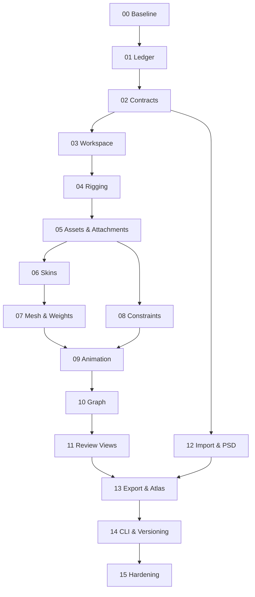

# Master Execution Roadmap for AI Agents

## 1. Kết quả cần đạt

Thực hiện dần từ source hiện tại đến một editor feature-complete tương đương
Spine 4.3.26. Lộ trình ưu tiên vertical slice chạy được, nhưng không bỏ qua
contract, migration, undo/redo, import/export, performance và provenance.

Mỗi step là một plan lớn. Các subplan trong step là đơn vị giao việc cho agent;
mỗi task cụ thể nên có kích thước 1, 2, 3, 5 hoặc tối đa 8 point.

## 2. Dependency graph

`STEP-12` có thể chạy song song sau khi `STEP-02` freeze contract. Trong mỗi
step, UI scaffolding có thể song song với model/runtime chỉ sau khi interface đã
merge; không tạo hai interface cạnh tranh.

## 3. Bảng thực thi theo bước

| Step | Plan                          | Requirement chịu trách nhiệm chính                   | Deliverable/gate                                                                            |
| ---- | ----------------------------- | ---------------------------------------------------- | ------------------------------------------------------------------------------------------- |
| 00   | Baseline & reproducibility    | Toàn cục                                             | Build/test/source inventory tái lập được; không còn claim dựa trên docs mà chưa verify      |
| 01   | Parity ledger                 | 209 feature ID + D43-01..28 = 237 parity requirement | Ledger machine-readable có owner, dependency, 8-layer state, evidence và provenance         |
| 02   | Contracts & document core     | Section 6, cross-cutting                             | Native round-trip cho mọi entity/channel; command/selection/task/diagnostic contract freeze |
| 03   | Workspace, Tree, Inspector    | UI-01..15, TREE-01..10, D43-03/16/22/23/27           | Workspace production; Tree/Inspector/Problems/Package Project chạy end-to-end               |
| 04   | Rigging & viewport            | RIG-01..11, TOOL-01..14, D43-07/13/14/22/23          | Project trống → skeleton/bones/slots/draw order → save/reopen hoàn toàn bằng UI             |
| 05   | Assets, attachments, sequence | ASSET-01..06, ATT-01..13, D43-04/08/09               | Mọi attachment được tạo/chỉnh; watcher, sequence, linked mesh, clipping survive round-trip  |
| 06   | Skins                         | SKIN-01..08, D43-15/18/20                            | Hai skin dùng chung animation; pin/mix/merge/copy/dependency và atlas preview đúng          |
| 07   | Mesh & weights                | WGT-01..13, D43-04/05                                | Lab algorithms thành product workflow; multi-mesh, sparse undo và performance gate          |
| 08   | Constraints & physics         | CON-01..12, D43-01/02/10/13                          | IK/transform/path/physics/slider create-edit-key-preview-export bằng UI                     |
| 09   | Animation, Dopesheet, Events  | ANIM-01..13, DOPE-01..08, EVT-01..05, D43-07/11/13   | Full-channel key authoring, sync, audio/event/sequence/deform/constraint keys               |
| 10   | Graph & curves                | GRAPH-01..10, D43-12                                 | Curve editing khớp runtime; shape preservation và tangent/preset đầy đủ                     |
| 11   | Playback, Preview & auxiliary | VIEW-01..14, ASSET-05..06, EVT-02/03/05, D43-26      | Multi-track preview, ghost/audio/metrics/outline/color/validator không mutate document      |
| 12   | Import & PSD                  | IMP-01..08, legacy profiles, D43-19                  | Project/data/PSD import transactional; preflight và loss decision trước commit              |
| 13   | Export, render & texture      | EXP-01..10, PACK-01..12, D43-06/17/20/21/24          | Data/render/video/HTML/atlas deterministic; atomic cancel và visual/golden diff             |
| 14   | CLI, settings & versioning    | CLI-01..06, SET-01..06, UI-10/13/14/15, D43-16/25/27 | Headless pipeline, settings migration, recovery/package project và validator executable     |
| 15   | Compatibility hardening       | D43-28 + toàn bộ ID                                  | Không silent loss; accessibility/performance/security/recovery/packaging gates xanh         |

## 4. Freeze points

| Freeze | Sau step | Không được thay đổi tùy tiện                                                                 |
| ------ | -------- | -------------------------------------------------------------------------------------------- |
| F0     | 01       | Scope, ID, terminology, replication/provenance policy, trạng thái ledger                     |
| F1     | 02       | Canonical identity, coordinate/time/color/path conventions, command và diagnostics contracts |
| F2     | 05       | Attachment/sequence/runtime pose contracts                                                   |
| F3     | 08       | Constraint interfaces, evaluation order và deterministic reset/warm-up                       |
| F4     | 10       | Key/curve/time/channel contracts và editor-runtime curve oracle                              |
| F5     | 14       | Import/export/CLI preset schema, exit codes, migration và compatibility claims               |

Phá freeze cần ADR, migration, fixture update, compatibility impact và approval.

## 5. Milestone

| Milestone           | Step bắt buộc | Chứng minh tối thiểu                                                                |
| ------------------- | ------------- | ----------------------------------------------------------------------------------- |
| M0 Program Ready    | 00–02         | Baseline tái lập, ledger 100% owner, contracts/golden native ổn định                |
| M1 Rigging Alpha    | 03–04         | VS-01 Character setup chạy bằng UI                                                  |
| M2 Setup Alpha      | 05–08         | VS-02, VS-03, VS-04 chạy, save/reopen và undo đầy đủ                                |
| M3 Animator Alpha   | 09–10         | VS-05 key/curve workflow và runtime oracle pass                                     |
| M4 Review Beta      | 11            | 15-track preview hoặc giới hạn công bố; ghost/audio/metrics pass                    |
| M5 Pipeline Beta    | 12–14         | VS-06 import → edit → export/pack/CLI → validator pass                              |
| M6 Parity Candidate | 15            | VS-07 và toàn bộ 237 parity requirement Complete + Verified hoặc approved exception |

## 6. Chu kỳ lập kế hoạch rolling

Chỉ mở tối đa hai step active trên critical path. Mỗi step thực hiện:

1. Step owner xác nhận precondition và tạo subplan backlog.
2. Reviewer chia task ≤8 point, chỉ task `Ready` mới được agent nhận.
3. Agent hoàn thành task packet, commit và report.
4. Step owner chạy integration gate mỗi 3–5 task hoặc khi interface thay đổi.
5. Khi tất cả subplan pass, chạy vertical slice và phase handoff.
6. Freeze tương ứng được ký, step tiếp theo mới mở.

## 7. Quy tắc song song hóa

- Có thể song song các package không cùng write ownership và không đổi shared
  contract.
- Interface/stub merge trước; implementation downstream rebase sau.
- Single-owner: canonical model, runtime evaluation order, native schema,
  capability registry, transform/curve semantics và root workspace config.
- Không giao hai agent cùng sửa một file high-risk trong cùng thời điểm.
- Reviewer agent không tự sửa feature đang review; mở defect/task mới nếu fail.

## 8. Release gate tổng

Program chỉ đạt parity khi:

- 237 parity requirement có evidence cho model/runtime/editor/command/import/export/tests/performance;
- mọi D43 delta có owning test hoặc approved `N/A` không làm giảm baseline;
- native round-trip no-loss; external downgrade không silent-loss;
- browser/E2E recording chứng minh 7 vertical slice;
- build/typecheck/unit/integration/E2E/golden/visual/performance/security xanh;
- SBOM, notices, provenance, migration, recovery và user/developer docs hoàn tất.
