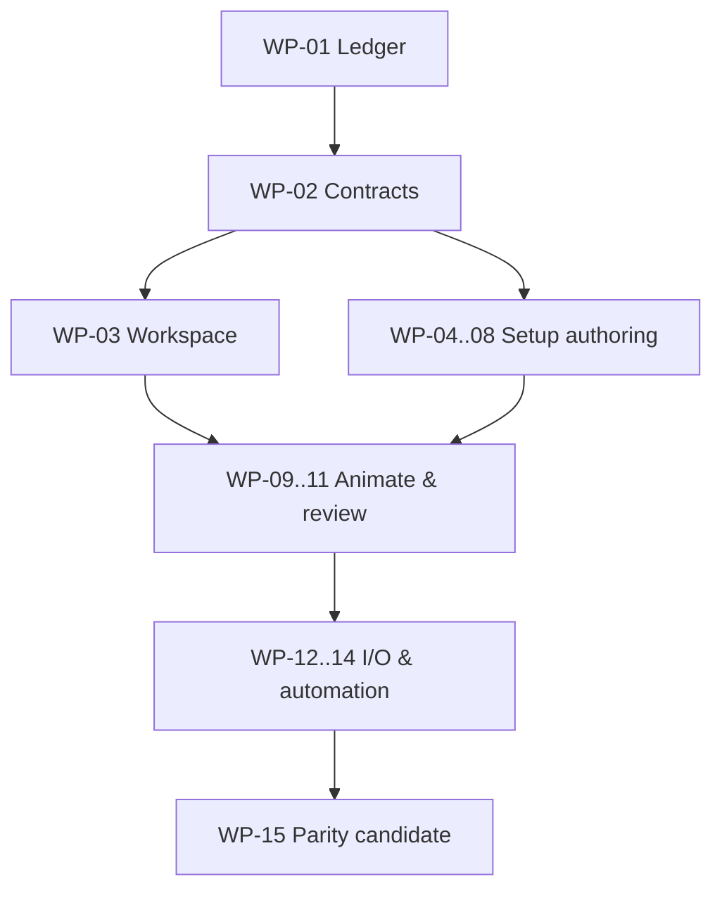

# Rigora — Spine 2D Full Feature Clone Master Plan

> Trạng thái tài liệu: **baseline sau audit**
> Ngày audit: **2026-09-20**
> Target khóa: **Spine 4.3.26 stable** (4.3.27 đang unreleased tại ngày audit)
> Chuẩn đối chiếu: User Guide + 4.3 changelog + runtime/data contracts + Academy/cheat sheet
> Phạm vi source đã đọc: `apps/`, `packages/`, `docs/` trong source đính kèm

## 1. Mục tiêu và ranh giới

Rigora phải là một **feature-complete clone** của Spine 2D Professional: cho phép
một animator hoàn thành mọi workflow sản xuất tương đương bằng UI, gồm dựng
skeleton, quản lý ảnh và skin, tạo/chỉnh mọi
loại attachment, mesh/weight, animation/curve, constraint/physics, preview,
import/export và tự động hóa.

Parity là **tương đương đầy đủ về khả năng, kết quả và workflow**. Rigora không
bắt buộc phải khác Spine về hình thức: có thể giữ UI, bố cục, hotkey, icon hoặc
wording gần/trùng khi điều đó làm giảm chi phí học lại và việc sử dụng là hợp
pháp. Tuy nhiên, mọi hạng mục vẫn phải có một implementation do Rigora kiểm soát
được; không được biến asset/code hoặc hành vi nội bộ không có quyền sử dụng thành
dependency bắt buộc. UI khác hình thức vẫn được chấp nhận nếu:

1. người dùng tìm được chức năng từ UI;
2. hoàn thành được cùng tác vụ mà không sửa JSON hoặc viết code;
3. dữ liệu được lưu, undo/redo, preview và export đúng;
4. giới hạn hoặc mất dữ liệu luôn được báo trước;
5. số bước và độ chính xác không kém đáng kể so với workflow tương ứng.

### 1.1 Phạm vi bắt buộc

- Toàn bộ chức năng editor và UI được mô tả trong User Guide: workspace, Setup,
  Animate, tools, views, import/export, texture packing, CLI và settings.
- Toàn bộ feature/QoL có tác động hành vi trong changelog của target stable,
  kể cả khi User Guide chưa cập nhật.
- Editor preview phải dùng cùng runtime semantics với file export: pose stages,
  timelines, mixing, clipping, constraints, physics, sequences và skins.
- Native `.hbone` phải biểu diễn superset đầy đủ của target; Spine 4.3
  JSON/binary/atlas là compatibility target chính. Import upgrade path phải phủ
  các major lịch sử 2.1, 3.5–3.8 và 4.0–4.2; source hiện có 3.8/4.2 và
  DragonBones chỉ là điểm khởi đầu, không phải full-clone gate.
- Chức năng mới hơn target được theo dõi trong surveillance ledger, không tự động
  làm trôi release scope đã freeze.

### 1.2 Ngoài phạm vi parity

- Mua license, activation/logout, launcher server của Esoteric Software, nội dung
  news/marketing và example có bản quyền của Spine.
- `Bake physics to keys` là extension có ích của Rigora, **không phải điều kiện
  parity**, vì User Guide hiện tại mô tả physics không hỗ trợ baking.

Mọi ngoại lệ khác phải có lý do, owner và quyết định sản phẩm; không được âm thầm
đánh dấu `N/A`.

### 1.3 Chính sách replication và giải pháp tương đương

Functional parity là release gate; mức độ giống về hình thức là quyết định UX,
compatibility và pháp lý, không phải điều kiện bắt buộc. Với mỗi capability,
team được chọn `replicate`, `adapt` hoặc `equivalent`, nhưng phải ghi provenance,
lý do và test chứng minh cùng kết quả/workflow.

| Thành phần                                          | Chính sách được phép                                                                                                               | Yêu cầu tối thiểu                                                                                    |
| --------------------------------------------------- | ---------------------------------------------------------------------------------------------------------------------------------- | ---------------------------------------------------------------------------------------------------- |
| UI layout và interaction                            | Có thể tái tạo rất gần để người dùng Spine chuyển sang không phải học lại; cũng có thể bố trí khác                                 | Đủ mọi state, affordance, error/disabled state, keyboard navigation và số bước không kém đáng kể     |
| Hotkey mặc định                                     | Ưu tiên profile `Spine-compatible`; có thể đặt trùng mặc định, đồng thời cho remap/import/export/reset                             | Có conflict detection; test theo context/mode; không hard-code làm mất khả năng tùy biến             |
| Tên lệnh, label, tooltip và text                    | Có thể giữ thuật ngữ/tên ngắn cần cho compatibility; câu mô tả dài nên viết lại trừ khi có quyền dùng                              | Terminology map; i18n key; meaning và cảnh báo không được yếu hơn bản đối chiếu                      |
| Icon và visual asset                                | Có thể dùng trực tiếp khi tự tạo, public-domain, permissive license hoặc có quyền rõ ràng; nếu không thì thiết kế icon tương đương | Asset inventory ghi source/license; cùng semantic/state/visibility ở kích thước sử dụng              |
| Thuật toán công khai/tiêu chuẩn                     | Có thể triển khai từ paper, specification hoặc implementation có license tương thích                                               | Ghi nguồn, license, numeric fixtures, benchmark và regression tests                                  |
| Thuật toán/hành vi độc quyền không có source hợp lệ | Viết lại độc lập từ public behavior, input/output fixtures, exported data và black-box oracle; được dùng thuật toán khác           | Không chép code/decompile trái quyền; đạt cùng observable behavior trong tolerance đã công bố        |
| Mã nguồn, example, branding và asset của Spine      | Chỉ tái sử dụng khi license/quyền sử dụng cho phép; nếu không phải thay thế                                                        | Provenance gate tự động; không ship trademark/branding hoặc sample có bản quyền ngoài quyền được cấp |

Mỗi quyết định `replicate/adapt/equivalent` phải được lưu trong parity ledger với:
`requirement ID`, `reference behavior`, `implementation strategy`, `provenance`,
`license/permission`, `oracle`, `tolerance`, `UX deviation` và `review owner`.
Nếu tình trạng quyền sử dụng chưa rõ, implementation mặc định là giải pháp tương
đương do dự án tự tạo; đây là policy quản trị rủi ro chứ không giảm scope parity.

### 1.4 Chính sách version-lock

- **Release baseline:** mọi feature có trong Spine 4.3.26 stable là bắt buộc.
- **Patch parity:** bug fix trong changelog được chuyển thành regression test nếu
  nó mô tả observable behavior, data integrity hoặc crash boundary.
- **Unreleased/beta:** 4.3.27 và roadmap không phải release gate, nhưng được theo
  dõi để tránh quyết định kiến trúc đóng đường nâng cấp.
- **Legacy:** parity không có nghĩa tái tạo UI cũ; nghĩa là mở/import/upgrade dữ
  liệu cũ với warning và kết quả tương đương target stable.
- Target chỉ được đổi bằng ADR ghi snapshot version/date, delta inventory,
  migration và ảnh hưởng milestone.

### 1.5 Thứ tự ưu tiên nguồn bằng chứng

1. Changelog stable và binary/JSON/runtime behavior của đúng version target.
2. User Guide hiện hành và các trang reference chính thức.
3. Official runtime source/tests, Skeleton Viewer và example projects.
4. Academy, cheat sheet, export scripts, blog release và video/tutorial chính thức.
5. Forum/support reports để tìm edge case; phải tái hiện trước khi thành contract.
6. Roadmap chỉ dùng cho architecture surveillance, không được tính là feature đã
   tồn tại.

Khi các nguồn mâu thuẫn, hành vi chạy được của target stable và exported data có
độ ưu tiên cao nhất; kết luận phải được ghi lại bằng fixture/test, không chỉ bằng
trích dẫn.

## 2. Cách đọc trạng thái

Một feature được theo dõi độc lập qua tám lớp:

`model`, `runtime`, `editor`, `command`, `import`, `export`, `tests`,
`performance`.

| Mã  | Ý nghĩa                                                             |
| --- | ------------------------------------------------------------------- |
| `P` | Có trong product editor nhưng còn thiếu chiều sâu hoặc verification |
| `F` | Có foundation/service/thuật toán, chưa thành workflow UI đầy đủ     |
| `L` | Chỉ có trong lab/demo/fixture, không tính là product parity         |
| `R` | Chỉ có model/runtime                                                |
| `M` | Không tìm thấy trong source đính kèm                                |
| `V` | Có tuyên bố trong docs nhưng cần chạy build/test để xác minh        |

**Quy tắc:** một package, type, test hoặc control trong Compatibility Lab không
được tính là `editor complete`. Chỉ được đánh dấu hoàn thành khi workflow chạy
end-to-end trong product editor và qua cổng ở mục 11.

## 3. Kết luận audit source hiện tại

Source có nền tảng kỹ thuật đáng kể nhưng chưa đạt Spine parity ở tầng sản phẩm.
Khoảng cách lớn nhất là hợp nhất các thuật toán/lab vào Editor Shell, phủ toàn bộ
UI interaction, import/export và kiểm thử workflow.

| Khu vực          | Bằng chứng trong source                                   | Trạng thái | Kết luận                                                                  |
| ---------------- | --------------------------------------------------------- | :--------: | ------------------------------------------------------------------------- |
| Project          | `@rigora/project`, `.hbone`, migration, autosave/recovery |    `P`     | Có nền tảng New/Open/Save/Save As và recovery                             |
| Workspace        | `apps/editor-shell`, FlexLayout, Radix                    |    `P`     | Mới có 4 panel chính; thiếu phần lớn view và settings                     |
| Stage            | Pixi stage, camera, grid/rulers, framing, bone selection  |    `P`     | Chưa phải rig/attachment authoring viewport hoàn chỉnh                    |
| Tree/Inspector   | Hierarchy và bone-name inspector tối thiểu                |    `P`     | Thiếu tree semantics, filters, properties và drag/drop đầy đủ             |
| Animation        | `@rigora/animation` và Timeline UI nhiều channel          |   `P/F`    | Nền tảng tốt; dopesheet/graph interaction chưa đủ chuẩn production        |
| Mesh/Weights     | `@rigora/authoring-mesh` và Compatibility Lab             |   `L/F`    | Thuật toán khá rộng nhưng chưa tích hợp product editor                    |
| Constraints      | IK/transform/path/physics model và runtime                |   `R/L`    | Có solver/preview lab; thiếu authoring UI hoàn chỉnh; chưa có Slider      |
| Attachments      | Schema nhiều loại và lab controls                         |   `R/L`    | Thiếu workflow product, Sequence và common property coverage              |
| Skins            | Canonical data hỗ trợ một phần                            |   `R/M`    | Chưa có Skins view, placeholder/pinning workflow hoàn chỉnh               |
| Preview/Views    | Playback/graph cơ bản trong Timeline                      |    `F`     | Thiếu Preview, Ghosting, Audio, Metrics, Outline, Slot Color...           |
| Compatibility    | Spine/DragonBones adapters và conversion lab              |   `L/F`    | Lab tự ghi chưa có full verification; không được coi là round-trip parity |
| Export/Atlas/CLI | format packages và tài liệu kiến trúc                     |   `F/V`    | Chưa thấy UI/CLI sản phẩm bao phủ toàn bộ workflow của guide              |

### 3.1 Giới hạn của audit

Đây là static audit trên snapshot đính kèm. Snapshot không có đầy đủ root
workspace/test fixtures được một số file tham chiếu, nên các mục `V` phải được
xác minh bằng build, test và thao tác UI trước khi đổi trạng thái. Các tài liệu
“completed batch” là bằng chứng tiến độ, không tự động là bằng chứng parity.

### 3.2 Khoảng cách version/format

| Profile                            | Mục tiêu full clone                                         | Source hiện tại                   | Gap                                                 |
| ---------------------------------- | ----------------------------------------------------------- | --------------------------------- | --------------------------------------------------- |
| Native `.hbone`                    | Superset toàn bộ 4.3.26, no-loss                            | Có container/migration foundation | Thiếu nhiều schema 4.3 và product workflows         |
| Spine 4.3                          | Import/export JSON, binary, atlas + exact runtime semantics | Không thấy adapter 4.3            | Blocker cấp P0                                      |
| Spine 4.2                          | Import/export profile và downgrade report                   | Có package subset/physics work    | Cần corpus + UI + no-silent-loss proof              |
| Spine 4.0–4.1                      | Import/upgrade legacy                                       | Không thấy adapter riêng          | Phải thêm hoặc chứng minh parser chung              |
| Spine 3.5–3.8                      | Import/upgrade; 3.8 export nếu sản phẩm giữ cam kết         | Có 3.8/3.8.75 work                | Cần bỏ mọi giả định “3.8.75 là parity target chính” |
| Spine 2.1/older supported projects | Import/upgrade theo khả năng target 4.3                     | Không thấy                        | Corpus-driven migration                             |
| DragonBones                        | Tính năng mở rộng, không thay thế Spine parity              | Có 5.5/6.0 foundation             | Giữ như compatibility track riêng                   |

## 4. Kiến trúc UI tương đương bắt buộc

Tên và vị trí có thể khác Spine, nhưng Rigora phải cung cấp các surface sau và
duy trì selection/document/playback state nhất quán giữa chúng.

| Surface                             | Khả năng bắt buộc                                                                                                        |
| ----------------------------------- | ------------------------------------------------------------------------------------------------------------------------ |
| Welcome / Project Browser           | Recent, filter/search, pin/favorite, examples của Rigora, create/open, recovery entry                                    |
| Main menu / title bar               | File/Edit/View/Setup/Animate/Export/Help; document title/dirty state; undo/redo; workspace controls                      |
| Setup / Animate modes               | Mode rõ ràng; tool/property/keying thay đổi theo mode; giữ selection hợp lệ                                              |
| Tree / Outline                      | Full hierarchy, filters, search/find-replace, visibility, keying, relationships, drag/drop, context actions              |
| Stage / Viewport                    | Render đúng pose; select/manipulate; camera; overlays; tools; multi-skeleton; diagnostics                                |
| Inspector / Properties              | Schema-driven fields, mixed values, key state, numeric expressions, reset/copy/paste, validation                         |
| Images / Assets                     | Image/audio discovery, watcher, search/filter, drag/drop, used/missing state, path management                            |
| Animations                          | Animation folders/list, create/rename/delete/duplicate, active animation, skeleton selector                              |
| Timeline / Dopesheet                | Rows, keys, range, filters, selection, editing, clipboard, key controls, sync                                            |
| Graph                               | Curves/handles/presets, property rows, multi-curve editing, navigation, timeline sync                                    |
| Mesh Tools                          | Topology, soft selection, UV/deformed modes, trace/generate, validation                                                  |
| Weights                             | Binding, numeric weights, pies/overlay, direct/brush, auto/smooth/prune/weld/lock/update                                 |
| Skins                               | CRUD, active skin, pin multiple, order/override, placeholders, skin bones/constraints                                    |
| Playback                            | Play/pause/step/scrub/loop, speed, FPS, global stepped/interpolated controls                                             |
| Preview                             | Independent camera; multi-track animation mix; skin, alpha, repeat, additive, hold previous                              |
| Ghosting                            | Before/after/key frames, steps, motion vectors, styles/colors, loop, offset, selection-only                              |
| Audio                               | Waveform, event tracks, selection/dimming, volume/mute, device and missing-file state                                    |
| Metrics                             | Skeleton/attachment/timeline counts; vertices/transforms/triangles/area; CPU/fill/draw calls                             |
| Outline navigator                   | Uncluttered pose, pan/zoom, click-to-center viewport, optional ghosting                                                  |
| Slot Color                          | Adaptive RGBA/HSV control, light/dark tint preview, alpha and multi-selection                                            |
| Problems                            | Centralized warnings/errors, entity navigation, live refresh, one-click safe fixes and fix result                        |
| Import / Export / Pack              | Presets, options, preview/report, warnings, progress, cancellation and deterministic output                              |
| Settings / Hotkeys                  | Application/UI/viewport/behavior settings, searchable shortcuts, conflict detection, reset                               |
| Diagnostics / Tasks                 | Import/export loss report, background jobs, logs, retry/cancel and actionable entity links                               |
| Runtime Validator / Skeleton Viewer | Load exported JSON/binary+atlas, file watch/reload, PMA toggle, debug overlays, setup reset, animation/mix/skin controls |

### 4.1 Interaction contract chung

- Mọi view dock/undock, resize, minimize/restore, close/reopen, focus bằng
  keyboard và lưu layout theo workspace; hỗ trợ nhiều màn hình nếu nền tảng cho
  phép.
- Selection đồng bộ hai chiều giữa Tree, Stage, Inspector, Dopesheet, Graph,
  Weights và Preview. Có single, toggle, range, box/lasso và selection history.
- Mọi thay đổi persistent đi qua command transaction. Một gesture kéo hoặc một
  brush stroke là một undo step; cancel trả về snapshot trước gesture.
- Field số hỗ trợ nhập tuyệt đối, cộng/trừ tương đối, nhân/chia, drag/wheel và
  fine step; multi-selection hiển thị mixed value. Target 4.3 còn yêu cầu biểu
  thức toán học, biến theo context (`value`, bone length/rotation...), hàm an
  toàn (`clamp`, `random` có seed policy) và locale decimal hợp lệ.
- Context menu, tooltip/on-demand help, shortcut, focus ring, keyboard navigation
  và status feedback có trên mọi action quan trọng.
- Background task dài có progress, cancel an toàn, diagnostic và không khóa UI.
- Không có silent fallback: unsupported import/export luôn hiển thị capability
  report trước khi ghi file.

## 5. Ma trận parity đầy đủ theo Spine User Guide

Mỗi dòng dưới đây là một requirement group. **Tất cả** các mục ngăn bởi dấu `;`
trong một dòng phải đạt thì dòng đó mới được chuyển sang `Complete`.

### 5.1 Workspace, project và navigation

| ID    | Spine capability cần tương đương                                 | Rigora UI/behavior bắt buộc                                                                                                                                   | Baseline |
| ----- | ---------------------------------------------------------------- | ------------------------------------------------------------------------------------------------------------------------------------------------------------- | :------: |
| UI-01 | Main menu, titlebar actions, project open paths                  | Menu/toolbar đầy đủ; New/Open/Save/Save As/Recent; dirty state; OS và custom file dialog hợp lệ                                                               |   `P`    |
| UI-02 | Custom file dialog: recent, favorite, remove, filter, paste path | Project/file picker có recent/pin/search/path và error state                                                                                                  |   `M`    |
| UI-03 | Views dạng tab, move/resize/minimize/close/focus                 | Docking workspace persistent; reopen view; focus shortcut; multi-monitor policy                                                                               |   `P`    |
| UI-04 | Setup và Animate mode                                            | Mode switch toàn cục; mode-specific panels/tools; invalid action disabled có giải thích                                                                       |   `M`    |
| UI-05 | Viewport pan/zoom/100%/fit                                       | Pan/zoom-to-pointer, frame selected/all, reset/100%, camera persistence                                                                                       |   `P`    |
| UI-06 | Undo/redo và hotkey tùy chỉnh                                    | Unified command history; labels; shortcut editor/import/export/conflict detection                                                                             |  `P/F`   |
| UI-07 | Welcome: recent/filter/examples/news/tips/learn/changelog        | Welcome của Rigora có recent/filter/recovery/examples/help/changelog; news là optional                                                                        |   `M`    |
| UI-08 | Nhiều skeleton trong project                                     | Create/import/delete/rename/select; visibility; unload; dim unselected; per-skeleton export                                                                   |  `R/M`   |
| UI-09 | Skeleton reference scale và draw order                           | Inspector + Tree reorder; export toggle; reference scale affects physics/tools consistently                                                                   |   `M`    |
| UI-10 | Versioning, backward compatibility, backups/recovery             | File version shown; migration preview; forward-version block; backup browser; recovery compare/restore                                                        |   `F`    |
| UI-11 | Selection breadcrumbs                                            | Breadcrumb parents with configurable depth; click/reveal/context; update across Tree/Stage/Inspector                                                          |   `M`    |
| UI-12 | Problems view và fixes                                           | Aggregate warning icons, missing assets, scan limits, invalid rig/data; select problem reveals entity/skin; safe auto-fix with undo                           |   `M`    |
| UI-13 | Package Project                                                  | Create portable ZIP with project/images/required metadata; include/export-disabled policy; manifest and missing-file report                                   |   `M`    |
| UI-14 | External-change and file integrity safety                        | Detect disk changes, retry/lock, atomic save/copy, out-of-memory warning, repair/recovery without corruption                                                  |  `F/M`   |
| UI-15 | Spine-compatible migration profile                               | Optional layout/terminology/default-hotkey profile gần Spine; semantic icon/state mapping; one-click switch/reset; mọi deviation có workflow-equivalence test |   `M`    |

### 5.2 Tree, search và organization

| ID      | Spine capability cần tương đương                                    | Rigora UI/behavior bắt buộc                                                                                  | Baseline |
| ------- | ------------------------------------------------------------------- | ------------------------------------------------------------------------------------------------------------ | :------: |
| TREE-01 | Expand/collapse; multi/range select; auto-scroll; selection history | Virtualized hierarchy; keyboard nav; reveal selection; back/forward selection                                |   `P`    |
| TREE-02 | Entity visibility, selection lock, key controls                     | Per-row toggle/tri-state; batch toggle; key-state feedback; undoable persistent state                        |   `M`    |
| TREE-03 | Relationship annotations và property area                           | Target/constrained/skin/attachment annotations; contextual property widgets                                  |   `M`    |
| TREE-04 | Drag/drop hierarchy và context actions                              | Validate reparent/reorder; insertion preview; auto-scroll; cancel; atomic undo                               |   `M`    |
| TREE-05 | Type filters và context-sensitive filtering                         | Filter chips for skeleton/bone/slot/attachment/skin/constraint/event/audio/folder                            |   `M`    |
| TREE-06 | Text search, wildcard/regex                                         | Search modes, match highlighting, next/previous, invalid-regex feedback                                      |   `M`    |
| TREE-07 | Find/replace với preview và scopes                                  | Name/path replace preview; type/scope filters; unused/missing images/folders queries                         |   `M`    |
| TREE-08 | Hover image preview                                                 | Safe thumbnail/metadata preview with missing/large-image states                                              |   `M`    |
| TREE-09 | Tree display settings                                               | Skeleton names, slot folders under bones, slot paths, skin attachment/bone/constraint visibility             |   `M`    |
| TREE-10 | Folder operations                                                   | Create/color/rename/move/duplicate recursively; slash-to-folder naming; preserve expansion and runtime paths |   `M`    |

### 5.3 Skeleton, bones, slots và drawing

| ID     | Spine capability cần tương đương                   | Rigora UI/behavior bắt buộc                                                                                                      | Baseline |
| ------ | -------------------------------------------------- | -------------------------------------------------------------------------------------------------------------------------------- | :------: |
| RIG-01 | Bone hierarchy và immutable creation draw order    | Create/delete/duplicate/reparent/reorder view; preserve deterministic evaluation and creation order metadata                     |  `R/P`   |
| RIG-02 | Bone x/y/rotation/scale/shear/length               | Gizmos + Inspector; Local/Parent/World axes; exact numeric edit; multi-edit; reset                                               |   `P`    |
| RIG-03 | Inherit rotation/scale/reflection, keyable         | Setup properties and Animate keys; validation across negative scale/reflection                                                   |  `R/F`   |
| RIG-04 | Bone icon, color, name tag, selectable, visibility | Inspector fields and viewport/tree feedback; batch edit                                                                          |   `M`    |
| RIG-05 | Add bone to skin; Split; Separate X/Y              | Skin membership; nested/Fibonacci split; independent translate/scale channels                                                    |  `M/F`   |
| RIG-06 | Slot draw order                                    | Tree/viewport reorder; draw-order keys; ghost preview; invalid move diagnostics                                                  |  `R/F`   |
| RIG-07 | Slot light color/alpha, dark tint, blend modes     | Normal/additive/multiply/screen; two-color tint; separate color/alpha keying                                                     |  `R/F`   |
| RIG-08 | Slot folders và runtime paths                      | Folder create/reorder/rename; explicit runtime-name/path preview and export mapping                                              |   `M`    |
| RIG-09 | Slot/attachment visibility and hiding              | Visibility hierarchy with setup-vs-editor-only distinction                                                                       |   `F`    |
| RIG-10 | Multi-skeleton draw order and visibility           | Stage order control, selectability, solo/isolate and dimming                                                                     |   `M`    |
| RIG-11 | Draw-order folders                                 | Folder CRUD/reset; mixed folder+slot selection; independent folder timelines; multiple tracks without global draw-order conflict |   `M`    |

### 5.4 Images, audio và assets

| ID       | Spine capability cần tương đương                           | Rigora UI/behavior bắt buộc                                                            | Baseline |
| -------- | ---------------------------------------------------------- | -------------------------------------------------------------------------------------- | :------: |
| ASSET-01 | Images path, subfolders, PNG/JPG/JPEG lookup               | Project asset roots; normalized relative paths; thumbnail browser; case diagnostics    |  `F/M`   |
| ASSET-02 | Watcher hot reload và scan limit                           | File watcher, debounce, manual rescan, configurable cap, stale/missing state           |   `M`    |
| ASSET-03 | Drag image vào viewport/bone/slot/attachment; multi-select | Drop-target preview; create slot/region or replace image; batch operation; atomic undo |   `L`    |
| ASSET-04 | Used/unused/missing visual state                           | Filters/badges, reference count, safe unused cleanup preview                           |   `M`    |
| ASSET-05 | Audio path; WAV/MP3/OGG; watcher                           | Audio root, discovery, waveform cache, missing/unsupported diagnostics                 |   `M`    |
| ASSET-06 | Audio event volume/balance, mute/visibility                | Event/audio inspector; per-event and global controls; preview device selection         |   `M`    |

### 5.5 Viewport tools và selection

| ID      | Spine capability cần tương đương                    | Rigora UI/behavior bắt buộc                                                                                                  | Baseline |
| ------- | --------------------------------------------------- | ---------------------------------------------------------------------------------------------------------------------------- | :------: |
| TOOL-01 | Smart, toggle, multi, box selection và deselect     | Predictable priority by active tool; visible candidate/cycle state                                                           |  `P/F`   |
| TOOL-02 | Selection history và 10 selection groups            | Back/forward selection; save/recall named or numbered groups                                                                 |   `M`    |
| TOOL-03 | Rotate/Translate/Scale/Shear tools                  | Handles, axes, pivot, snapping, multi-transform, cancel, numeric entry                                                       |  `P/F`   |
| TOOL-04 | Pose tool, multi-bone IK                            | Drag chain with temporary IK; choose affected range; key result correctly                                                    |  `R/L`   |
| TOOL-05 | Bone Length và Create tool                          | Create by drag/click; zero-length/arbitrary origin; recreate; parent/drop target feedback                                    |   `M`    |
| TOOL-06 | Move selected slots/images during bone creation     | Explicit compensation/move policy; preview and undo                                                                          |   `M`    |
| TOOL-07 | Local/Parent/World axes; rotation constraints/flips | Toolbar/shortcut + Inspector; correct negative-scale behavior                                                                |   `F`    |
| TOOL-08 | Image/Bone compensation                             | Toggle compensation modes; deterministic child/image pose preservation                                                       |   `M`    |
| TOOL-09 | Pixel snapping và Auto Key                          | Persistent toolbar toggles, status visibility, per-property behavior                                                         |  `F/P`   |
| TOOL-10 | View options: select/visible/name tags by type      | Bone/region/mesh/other granular overlays; selection lock/isolate                                                             |   `M`    |
| TOOL-11 | Grid, guides/rulers                                 | Adaptive grid; ruler units; draggable guides; snapping and visibility settings                                               |  `P/F`   |
| TOOL-12 | Copy/paste transforms và vertex positions           | Local/world paste choice, compatible-target validation, multi-target mapping                                                 |  `F/L`   |
| TOOL-13 | Key Constrained                                     | Key visible post-constraint values for selected axes/properties; manual physics/constraint baking; undo and precision tests  |  `M/F`   |
| TOOL-14 | Numeric expression engine                           | Safe parser, variables/functions, assignment prefixes, locale decimals, per-item evaluation in multi-select and clear errors |   `M`    |

### 5.6 Attachments và sequence

| ID     | Spine capability cần tương đương                | Rigora UI/behavior bắt buộc                                                                                                  | Baseline |
| ------ | ----------------------------------------------- | ---------------------------------------------------------------------------------------------------------------------------- | :------: |
| ATT-01 | Common Select/Export/Name/Color/Set Parent      | Common attachment Inspector and Tree actions; batch edit; export capability preview                                          |  `R/L`   |
| ATT-02 | Region: path, transform, sequence, region↔mesh | Viewport/Inspector create/edit; odd-pixel positioning; conversion with loss preview                                          |  `R/L`   |
| ATT-03 | Sequence frames và playback modes               | Hold/Once/Loop/Pingpong + reverse variants; FPS/frame keying; missing frame report                                           |   `M`    |
| ATT-04 | Mesh path/wireframe/Edit/Freeze/Reset           | Product Mesh Tools view; setup/deformed/UV modes; reversible reset                                                           |  `L/F`   |
| ATT-05 | Mesh vertices/edges/triangles/hull/holes        | Modify/Create/Delete/New, manual edges/loops, triangulation validation, isolate/dim                                          |  `L/F`   |
| ATT-06 | Generate/Trace mesh                             | Detail/concavity/refinement/alpha threshold/padding; preview/refresh/apply/cancel                                            |  `L/F`   |
| ATT-07 | Mesh pivot/transform and image resize handling  | Movable pivot; transform mesh safely; prompt for UV/geometry strategy on image resize                                        |   `L`    |
| ATT-08 | Linked mesh và inherit timelines                | Create/link/unlink across same **or different slots**; inherit deform/sequence; source navigation; cycle diagnostics         |  `R/L`   |
| ATT-09 | Bounding box create/edit/freeze/weights/deform  | Product viewport workflow, topology validation and keys                                                                      |  `R/L`   |
| ATT-10 | Clipping attachment và end slot                 | Edit/freeze; clipping range preview; normal/inverse and general/convex-hull modes; self-intersection/performance diagnostics |  `R/L`   |
| ATT-11 | Path: Bézier, length, closed, constant speed    | Knot/handle editor; create/delete/new/reverse; angle lock/cusps; weights/deform                                              |  `R/L`   |
| ATT-12 | Point: position/rotation, skin support          | Create/edit/parent/skin; explicitly show non-keyable direct behavior                                                         |  `R/M`   |
| ATT-13 | Nested skeleton/unknown attachment handling     | Native authoring policy or read-only preservation; never silently discard                                                    |  `R/M`   |

### 5.7 Skins

| ID      | Spine capability cần tương đương                       | Rigora UI/behavior bắt buộc                                                                                 | Baseline |
| ------- | ------------------------------------------------------ | ----------------------------------------------------------------------------------------------------------- | :------: |
| SKIN-01 | Skin CRUD, folders, color, export                      | Skins view with create/duplicate/rename/delete/reorder/folder/export/color                                  |  `R/M`   |
| SKIN-02 | Một active skin và nhiều pinned visible skins          | Active/pin/unpin; pinned order; attachment override resolution preview                                      |   `M`    |
| SKIN-03 | Skin placeholders                                      | Create/rename/remove placeholder; Tree grouping; runtime path/name preview                                  |  `R/M`   |
| SKIN-04 | Add attachments to skin                                | Move/duplicate strategy; linked mesh/inherit deform; optional duplicate keys; rename policy                 |   `M`    |
| SKIN-05 | Skin-specific bones/constraints                        | Add/remove; warning when hidden dependency is required; viewport visibility policy                          |  `R/M`   |
| SKIN-06 | Duplicate/similar/programmatic/mix-and-match workflows | Batch assignment, copy mapping, compare and missing-placeholder report                                      |   `M`    |
| SKIN-07 | Merge/copy skins bằng drag/drop                        | Drop skin/placeholder/folder; options preview; auto-add dependency bones/constraints; fixups; one undo      |   `M`    |
| SKIN-08 | Large-skin workflow                                    | Only-pinned filtering, folder colors/pinning, pinned attachments under placeholders, per-skin atlas preview |   `M`    |

### 5.8 Mesh weights và deform

| ID     | Spine capability cần tương đương            | Rigora UI/behavior bắt buộc                                                                                 | Baseline |
| ------ | ------------------------------------------- | ----------------------------------------------------------------------------------------------------------- | :------: |
| WGT-01 | Bind/unbind mesh ↔ bones                   | Bind selection UI, bone list, update bindings, unbind/remap confirmation                                    |  `L/F`   |
| WGT-02 | Numeric weights và mixed values             | Per-vertex/per-bone table, normalized editing, multi-selection mixed state                                  |   `L`    |
| WGT-03 | Pies, Overlay, Selected filter              | Heatmap/pies/overlay visualization; palette legend; selection-only mode                                     |   `L`    |
| WGT-04 | Direct weight editing                       | Drag/edit influence directly; normalization/locked weights behavior visible                                 |   `L`    |
| WGT-05 | Brush Add/Remove/Replace                    | Radius/strength/feather/falloff; cursor preview; sparse delta; one stroke/undo                              |  `L/F`   |
| WGT-06 | Auto weights by vertices/bones              | Selection-scoped preview/apply/cancel; failure diagnostics and deterministic result                         |  `L/F`   |
| WGT-07 | Smooth và normalization                     | Scoped smooth, iteration/strength, locked influence policy, live preview                                    |  `L/F`   |
| WGT-08 | Prune with max bones/threshold              | Live preview; preserve normalization; report changed vertices                                               |  `L/F`   |
| WGT-09 | Weld all/overlapping, Swap, Lock            | Full commands with validation, numeric tolerance and undo                                                   |  `F/M`   |
| WGT-10 | Copy/paste weights và duplicated-bone remap | Compatible topology mapping, remap UI, ambiguity report                                                     |  `F/L`   |
| WGT-11 | Soft selection for mesh/path/bbox/clipping  | Size/feather/hull-only controls; consistent transform behavior                                              |  `F/L`   |
| WGT-12 | Deform authoring                            | Setup vs animation deform; zero/reset; weighted/unweighted; graph/dopesheet integration                     | `R/L/F`  |
| WGT-13 | Multi-attachment operations                 | Bind/weld/auto/smooth/prune/paint/copy-paste across multiple meshes; common bones/mixed values; atomic undo |  `L/F`   |

### 5.9 Constraints và physics

| ID     | Spine capability cần tương đương                   | Rigora UI/behavior bắt buộc                                                                                                                                              | Baseline |
| ------ | -------------------------------------------------- | ------------------------------------------------------------------------------------------------------------------------------------------------------------------------ | :------: |
| CON-01 | Common order/reset-auto-order/mix                  | Constraint list/tree annotations; reorder; dependency preview; negative/>100 mix support where valid                                                                     |  `R/M`   |
| CON-02 | Copy/paste settings, folders, runtime names, skins | Common Inspector actions; folder/path preview; skin membership and warnings                                                                                              |   `M`    |
| CON-03 | IK one/two-bone chains                             | Create from selection; target; parent/child validation; positive bend; mix keying                                                                                        |  `R/L`   |
| CON-04 | IK compress/stretch/uniform/softness/volume        | Inspector + viewport feedback; scaleY volume-preserving mode; invalid-chain diagnostics                                                                                  |  `R/L`   |
| CON-05 | Transform constraint 4.3                           | Map any source transform property to one/many destination property types; source/constrained local-or-world spaces; clamp ranges; offsets/Match; per-axis/property mixes |  `R/L`   |
| CON-06 | Path constraint target and constrained bones       | Creation wizard; ordering; target slot/path validation; warnings                                                                                                         |  `R/L`   |
| CON-07 | Path spacing/position modes                        | Length/Fixed/Percent/Proportional; viewport handle; keying                                                                                                               |  `R/L`   |
| CON-08 | Path rotate modes and mixes                        | Tangent/Chain/Chain Scale; rotate offset; rotate/translate mixes; link controls                                                                                          |  `R/L`   |
| CON-09 | Physics axes và limit/FPS                          | Translate X/Y, Rotation, Shear X, Scale X; limit; scaleY volume-preserving mode; solver FPS; setup validation                                                            |  `R/L`   |
| CON-10 | Physics parameters                                 | Inertia/Strength/Damping/Mass/Wind/Gravity/Global/Mix; keyability/capability labels                                                                                      |  `R/L`   |
| CON-11 | Physics simulate/deterministic/reset/warm-up       | Toolbar/Preview controls; Reset/Reset All; warm-up export/preview policy; reference scale                                                                                |  `R/L`   |
| CON-12 | Slider constraint                                  | Source bone, Local, Property mapping, frame range, Loop, Additive, Frame keying, Mix                                                                                     |   `M`    |

### 5.10 Keys, animation và curves

| ID      | Spine capability cần tương đương                          | Rigora UI/behavior bắt buộc                                                                          | Baseline |
| ------- | --------------------------------------------------------- | ---------------------------------------------------------------------------------------------------- | :------: |
| ANIM-01 | Animation folders và CRUD                                 | Create/rename/delete/duplicate/folder/reorder; active animation; per-skeleton list                   |  `P/F`   |
| ANIM-02 | Timeline FPS, frame/fractional frame, scrub/repeat        | Project FPS; time/frame display; precise scrub; loop/range; snap policy                              |   `P`    |
| ANIM-03 | Auto Key, Key Edited, Key Shown và key-state colors       | Clear toolbar/field states; scope preview; shortcut; no accidental keying                            |  `F/P`   |
| ANIM-04 | Bone transform/inherit timelines                          | X/Y/rotate/scale/shear/inheritance; separate X/Y; setup-value semantics                              |  `P/F`   |
| ANIM-05 | Slot/attachment/color/tint/draw-order timelines           | Attachment, RGBA, dark tint, alpha, draw order; separate color/alpha                                 |  `P/F`   |
| ANIM-06 | Event và sequence timelines                               | Full payload and audio event; sequence mode/FPS/frame                                                |  `P/M`   |
| ANIM-07 | Deform and constraint timelines                           | Mesh/path/bbox/clipping deform; IK/transform/path/physics/slider properties/mixes                    |  `R/F`   |
| ANIM-08 | Clipboard/cut/delete/paste across compatible targets      | Type-aware mapping; preview conflicts; paste at playhead; atomic undo                                |  `P/F`   |
| ANIM-09 | Shift keys, Offset wrap loop                              | Ripple subsequent keys; loop-safe offset/wrap; preview affected range                                |  `M/F`   |
| ANIM-10 | Clean Up and Layered protection                           | Redundant-key cleanup preview; preserve protected/layered keys; report                               |   `M`    |
| ANIM-11 | Straight-ahead, pose-to-pose, layered, combined workflows | UI must support these without data corruption; workflow fixtures/documentation                       |   `F`    |
| ANIM-12 | Draw-order folder timelines                               | Key folders independently; stable slot add/move adjustments; additive/track capability explicit      |   `M`    |
| ANIM-13 | Constraint-result capture                                 | `Key Constrained` for all supported axes/properties, paste constrained values and preserve precision |  `M/F`   |

### 5.11 Dopesheet và Timeline views

| ID      | Spine capability cần tương đương                                | Rigora UI/behavior bắt buộc                                                                             | Baseline |
| ------- | --------------------------------------------------------------- | ------------------------------------------------------------------------------------------------------- | :------: |
| DOPE-01 | Overview/bone/property/other rows                               | Hierarchical virtual rows, collapse, order, entity/property icons and counts                            |  `P/F`   |
| DOPE-02 | Locked/unlocked rows, refresh/select, filters/current tool/skin | Pin/lock row set; auto/context filters; skin visibility behavior; reveal source                         |  `M/F`   |
| DOPE-03 | Numeric timeline position, auto-scroll, loop range              | Editable time/frame; follow-playhead; loop handles; persisted zoom/scroll                               |   `P`    |
| DOPE-04 | Click/toggle/all/box selections and persistent boxes            | Selection modes; named/persistent boxes or equivalent reusable range selection                          |  `P/F`   |
| DOPE-05 | Move/scale/reverse/duplicate/snap keys                          | Pivot/anchor choice; axis constraints; frame/value snap; collision policy; live preview                 |  `P/F`   |
| DOPE-06 | Adjust selected keys through viewport                           | Edit pose/property while retaining key selection and target time semantics                              |   `F`    |
| DOPE-07 | Key Shown, Sync and view settings                               | Scope controls shared with keying; sync with Graph/Stage; row/marker settings                           |   `F`    |
| DOPE-08 | Dopesheet-centric sync                                          | Selecting Dopesheet keys/timelines reveals matching Graph rows; inverse graph-centric mode and off mode |  `M/F`   |

### 5.12 Graph view

| ID       | Spine capability cần tương đương               | Rigora UI/behavior bắt buộc                                                                                  | Baseline |
| -------- | ---------------------------------------------- | ------------------------------------------------------------------------------------------------------------ | :------: |
| GRAPH-01 | Overview/bone/property/other rows              | Same channel model as Dopesheet; row lock/filter/order/current-tool scope                                    |  `F/P`   |
| GRAPH-02 | Separate properties and repeated curve display | X/Y and channel separation; loop-range repetitions; color/legend clarity                                     |   `F`    |
| GRAPH-03 | Stepped/linear/Bezier                          | Exact interpolation, convert selection, curve preview and runtime parity tests                               |  `P/F`   |
| GRAPH-04 | Automatic/Separate/Flat/Bounce/Ease presets    | Tangent modes/presets; store user presets; last-chosen default; deterministic serialization                  |  `F/M`   |
| GRAPH-05 | Pan/zoom, frame selected/all, auto zoom        | Independent axes, navigation shortcuts, stable framing while editing                                         |  `P/F`   |
| GRAPH-06 | Synced selection and box scale/reverse         | Bidirectional Dopesheet sync; transform selected keys around chosen pivot                                    |   `F`    |
| GRAPH-07 | Key/handle editing and axis restrictions       | Drag/duplicate/delete; time/value numeric input; snap to frames/values/keys                                  |   `F`    |
| GRAPH-08 | Handle gestures, Value/Shape modes             | Weighted handle behavior or functionally equivalent value/shape editing                                      |  `M/F`   |
| GRAPH-09 | Favor breakdown                                | Bias intermediate key while preserving endpoints/curve intent                                                |   `M`    |
| GRAPH-10 | Curve-shape preservation                       | Revalue/move keys adjusts handles to retain curve shape; flat/end behavior; regression oracle for edge cases |  `M/F`   |

### 5.13 Playback, Preview, Ghosting và auxiliary views

| ID      | Spine capability cần tương đương             | Rigora UI/behavior bắt buộc                                                                                                | Baseline |
| ------- | -------------------------------------------- | -------------------------------------------------------------------------------------------------------------------------- | :------: |
| VIEW-01 | Playback FPS/speed/stepped/interpolated      | Global Playback view or equivalent persistent controls                                                                     |  `P/F`   |
| VIEW-02 | Preview per skeleton, independent camera     | Select skeleton/skin/animation; pan/zoom independent of Stage                                                              |   `M`    |
| VIEW-03 | Preview up to 15 tracks                      | Track add/remove/order; speed/mix/repeat/alpha/hold previous/additive; crossfade                                           |  `M/F`   |
| VIEW-04 | Ghost frames/key frames before/after/current | Count/step/fractional; loop behavior; colors; realtime update                                                              |   `M`    |
| VIEW-05 | Ghost motion vectors and display modes       | Threshold; Images/Solid; Silhouette/Xray; Anchor/On top/X/Y offset                                                         |   `M`    |
| VIEW-06 | Ghost selection-only and lock/refresh        | Selection scope; freeze snapshot; explicit refresh                                                                         |   `M`    |
| VIEW-07 | Audio waveform and event tracks              | Waveform timeline, colored tracks, selection/dim, volume/mute/device                                                       |   `M`    |
| VIEW-08 | Metrics                                      | Counts for skeleton/constraints/slots/attachments/timelines plus vertices/transforms/triangles/area/clipping               |   `M`    |
| VIEW-09 | Performance metrics                          | CPU timing, fill rate/overdraw proxy, draw calls and selected-scope stats                                                  |   `M`    |
| VIEW-10 | Outline navigator                            | Simplified pose, click-to-center main viewport, pan/zoom, optional ghosting                                                |   `M`    |
| VIEW-11 | Color view                                   | Adaptive HSV/RGBA editor for every colorable item in Setup mode, including slot tint black/alpha and multi-edit            |   `M`    |
| VIEW-12 | Standalone Timeline view                     | Compact global timeline usable beside Dopesheet/Graph and synced playhead                                                  |   `F`    |
| VIEW-13 | Mesh Tools view                              | Tool modes and soft-selection controls available contextually and dockable                                                 |  `L/F`   |
| VIEW-14 | Runtime validation tool                      | Skeleton Viewer-equivalent load/drop/watch; atlas auto-discovery; PMA, scale, flip, debug; animation/skin/mix; setup reset |   `M`    |

### 5.14 Events

| ID     | Spine capability cần tương đương       | Rigora UI/behavior bắt buộc                                             | Baseline |
| ------ | -------------------------------------- | ----------------------------------------------------------------------- | :------: |
| EVT-01 | Event definitions: int/float/string    | CRUD and defaults; key overrides; Tree/Timeline/Inspector integration   |  `P/F`   |
| EVT-02 | Audio path, volume, balance            | Event audio assignment, waveform preview and export mapping             |   `M`    |
| EVT-03 | Event visibility, mute, viewport names | Per-event toggles and playback log; optional viewport label overlay     |  `F/M`   |
| EVT-04 | Event folders và runtime paths         | Folder organization and explicit exported name/path preview             |   `M`    |
| EVT-05 | Audio included in video export         | Mix policy, clipping warning, codec capability and deterministic timing |   `M`    |

### 5.15 Import

| ID     | Spine capability cần tương đương                 | Rigora UI/behavior bắt buộc                                                                                                              | Baseline |
| ------ | ------------------------------------------------ | ---------------------------------------------------------------------------------------------------------------------------------------- | :------: |
| IMP-01 | Import project skeletons/animations              | File/folder input; scale; choose all/skeleton; rename; new/current project                                                               |  `F/L`   |
| IMP-02 | Import JSON/binary                               | Format detection; scale; new/existing skeleton; capability scan; nonessential-data warnings                                              |  `F/L`   |
| IMP-03 | Existing attachments policy                      | Ignore/replace/preserve; conflict preview; rollback on failure                                                                           |  `M/L`   |
| IMP-04 | PSD file/scale/padding/trim/hidden layers        | PSD wizard and CLI; preview extracted hierarchy/images; deterministic names                                                              |   `M`    |
| IMP-05 | PSD output/overwrite/images path                 | Safe overwrite policy; output validation; relative images-root configuration                                                             |   `M`    |
| IMP-06 | PSD origin/tags/group-layer behavior             | Tags/equivalents for origin, slots, skins, merge/ignore, scale, rotate, trim/mask, mesh/source mesh and attachments                      |   `M`    |
| IMP-07 | PSD blend/draw-order/slash/attachment properties | Mapping report; smart-object reuse; source tracking; sanitize/escape names; preserve order; unsupported blend warning                    |   `M`    |
| IMP-08 | Repeat PSD sync                                  | PSD files under Images; source badges; missing-PSD problems; delete-vs-overwrite/orphan cleanup; retain/relink source mesh when possible |   `M`    |

### 5.16 Export và rendered output

| ID     | Spine capability cần tương đương             | Rigora UI/behavior bắt buộc                                                                                          | Baseline |
| ------ | -------------------------------------------- | -------------------------------------------------------------------------------------------------------------------- | :------: |
| EXP-01 | Data export JSON/Binary                      | Output/extension; pretty/minimal/version/nonessential/cleanup/export-all; warnings and presets                       |  `F/L`   |
| EXP-02 | Per-skeleton/entity export controls          | Honor skeleton/attachment export flags; dependency diagnostics; deterministic ordering                               |  `M/F`   |
| EXP-03 | Render GIF/PNG/APNG/PSD/JPEG                 | Format options, size/scale/crop/padding/background/transparency/FPS/frame range/quality                              |   `M`    |
| EXP-04 | Video AVI/MOV or platform-equivalent formats | Codec/container capability UI; alpha/audio where supported; quality/FPS/range                                        |   `M`    |
| EXP-05 | Export preview and common settings           | Preview frames, bounds, estimated output; additive-blend handling; last settings                                     |   `M`    |
| EXP-06 | Save/load presets                            | Versioned export settings file; portable paths; invalid-option diagnostics                                           |  `M/F`   |
| EXP-07 | Cancellation and transactional output        | Cancel safely; temp output then atomic replace; partial-file report                                                  |   `M`    |
| EXP-08 | HTML export                                  | Ready-to-open HTML using embedded player or web-component equivalent; animation/skin options; combine multiple skins |   `M`    |
| EXP-09 | Relative and reproducible paths              | Store relative paths where possible; show effective output filename/folder; cross-machine preset portability         |  `M/F`   |
| EXP-10 | Parallel export                              | Multithread image/video/data/CLI jobs with deterministic bytes/frames, bounded resources, progress and cancellation  |  `M/F`   |

### 5.17 Texture packing/unpacking

| ID      | Spine capability cần tương đương                        | Rigora UI/behavior bắt buộc                                                                            | Baseline |
| ------- | ------------------------------------------------------- | ------------------------------------------------------------------------------------------------------ | :------: |
| PACK-01 | Pack during export hoặc standalone; attachments/folders | Wizard/CLI; per-skeleton/single atlas; current-project mesh awareness                                  |  `F/V`   |
| PACK-02 | Strip whitespace/rotation/alias/blank/alpha threshold   | Settings + visual preview; mesh-safe trimming; diagnostics                                             |  `M/F`   |
| PACK-03 | Padding/edge/duplicate padding                          | Independent X/Y; edge/duplicate padding; bleed preview                                                 |  `M/F`   |
| PACK-04 | Size constraints                                        | Min/max, power-of-two, divisible-by-4, square, multi-page policy                                       |  `M/F`   |
| PACK-05 | Filter/wrap/format metadata                             | Min/mag, wrap X/Y, pixel format; runtime capability validation                                         |   `F`    |
| PACK-06 | PNG/JPG, grid/rect/polygon, PMA/bleed                   | Packing modes, output encoding, premultiply policy and warnings                                        |  `F/V`   |
| PACK-07 | Scale/suffix/resampling                                 | Multiple scale variants, suffix templates, smoothing/resample policy                                   |  `M/F`   |
| PACK-08 | pack.json inheritance and advanced options              | Combine/flatten/index/legacy/debug/auto-scale/fast/memory/pretty/current-project                       |  `M/F`   |
| PACK-09 | Nine-patch and image indexes                            | Preserve naming/index semantics and atlas metadata                                                     |   `M`    |
| PACK-10 | Atlas unpacker                                          | Unpack rect/polygon; optional project context; unpremultiply; collision-safe paths                     |  `M/F`   |
| PACK-11 | Atlas per skin                                          | Separate pages/atlas metadata for each skin; missing-region runtime policy; preview and CLI parity     |   `M`    |
| PACK-12 | PNG brute-force optimization                            | Optional slow smallest-output mode; cancellable; deterministic; memory/time estimates and safe default |   `M`    |

### 5.18 CLI, settings và application behavior

| ID     | Spine capability cần tương đương                        | Rigora UI/behavior bắt buộc                                                                                                                                  | Baseline |
| ------ | ------------------------------------------------------- | ------------------------------------------------------------------------------------------------------------------------------------------------------------ | :------: |
| CLI-01 | Headless export/import/cleanup                          | Stable commands, settings files, stdin-independent runs, machine-readable report and exit codes                                                              |  `F/V`   |
| CLI-02 | Pack/unpack/info and multiple commands                  | Composable batch invocations; folder input; output creation; non-zero failure                                                                                |  `F/V`   |
| CLI-03 | Input/output override and saved presets                 | CLI overrides settings deterministically; print effective configuration                                                                                      |  `F/V`   |
| CLI-04 | Version/help/advanced/trace/memory-like controls        | `--version`, help, verbose/trace, resource limits; ignore-unknown policy explicit                                                                            |  `M/F`   |
| CLI-05 | Target-4.3 extended options                             | Import all/named animations; structured `--set` overrides including arrays/objects; extra project checks/repair; export-all and version-locked help snapshot |   `M`    |
| CLI-06 | Skeleton Viewer launch                                  | `--skeleton-viewer` equivalent or standalone validator executable using same runtime core                                                                    |   `M`    |
| SET-01 | Files: backups/hotkeys/log                              | UI opens locations; configurable backup retention; editable/exportable hotkeys; diagnostics log                                                              |  `F/M`   |
| SET-02 | General: color management/blending/FPS/instance/welcome | sRGB/ICC capability, gamma/linear preview, editor FPS cap, reuse instance, startup behavior                                                                  |   `M`    |
| SET-03 | UI: language/font/size/scale/row/toolbar/tree indent    | Persistent settings with live preview, reset and accessibility limits                                                                                        |   `M`    |
| SET-04 | Viewport appearance/rendering                           | Background, backface culling, bone scale, bleed, highlight, missing-image mode, MSAA, pixel grid, smoothing/anisotropic                                      |  `M/F`   |
| SET-05 | Behavior                                                | Auto backup, delete confirmation, double-click, UI animation, middle-mouse pan, momentum, smooth scroll, tooltips, zoom-to-mouse                             |  `F/M`   |
| SET-06 | Dopesheet/Graph behavior                                | Box-select pause; jump-to-frame/key; graph drag-to-edit; all settings persistent                                                                             |   `M`    |

### 5.19 Target-4.3 delta ledger ngoài User Guide

User Guide không phải inventory đầy đủ. Các capability sau được xác nhận thêm từ
release announcement/changelog 4.3 và là **release gate**, không phải “nice to
have”. Dòng “Regression family” yêu cầu biến bug fixes có thể quan sát trong
4.3.00–4.3.26 thành tests, thay vì sao chép từng câu changelog vào backlog.

| Delta ID | Capability 4.3 stable                                                                                                                                                                   | Requirement IDs nhận trách nhiệm | Baseline |
| -------- | --------------------------------------------------------------------------------------------------------------------------------------------------------------------------------------- | -------------------------------- | :------: |
| D43-01   | Slider constraint và slider-driven reusable animations                                                                                                                                  | CON-12, ANIM-07, runtime matrix  |   `M`    |
| D43-02   | Transform constraint property mapping, clamping, local/world source+destination                                                                                                         | CON-05                           |  `R/L`   |
| D43-03   | Problems view, reveal problem, one-click fixes                                                                                                                                          | UI-12, Problems contract         |   `M`    |
| D43-04   | Trace nhiều mesh, uniform tracing và kết quả chính xác hơn                                                                                                                              | ATT-06, WGT-13                   |  `L/F`   |
| D43-05   | Paint/bind/weld/smooth/auto/prune/copy weights nhiều mesh                                                                                                                               | WGT-13                           |  `L/F`   |
| D43-06   | HTML export bằng player/web component, combine skins                                                                                                                                    | EXP-08                           |   `M`    |
| D43-07   | Draw-order folder keying độc lập và dùng trên nhiều tracks                                                                                                                              | RIG-11, ANIM-12                  |   `M`    |
| D43-08   | Inverse và convex-hull clipping                                                                                                                                                         | ATT-10, runtime clipping         |  `M/R`   |
| D43-09   | Linked mesh dùng source khác slot, inherit deform/sequence                                                                                                                              | ATT-08, runtime linked mesh      |  `R/L`   |
| D43-10   | Volume-preserving scaleY cho IK và physics                                                                                                                                              | CON-04, CON-09                   |  `M/R`   |
| D43-11   | Dopesheet-centric và graph-centric sync                                                                                                                                                 | DOPE-08                          |  `M/F`   |
| D43-12   | Curve-shape preservation và last-chosen default                                                                                                                                         | GRAPH-04, GRAPH-10               |  `M/F`   |
| D43-13   | Key Constrained / manual constraint-physics baking                                                                                                                                      | TOOL-13, ANIM-13                 |  `M/F`   |
| D43-14   | Math expressions, variables, functions và assignment prefixes                                                                                                                           | TOOL-14                          |   `M`    |
| D43-15   | Merge/copy skins qua drag/drop, auto dependency fixups                                                                                                                                  | SKIN-07                          |   `M`    |
| D43-16   | Package Project ZIP                                                                                                                                                                     | UI-13                            |   `M`    |
| D43-17   | Relative export paths                                                                                                                                                                   | EXP-09                           |  `M/F`   |
| D43-18   | Only-pinned skin filters và improved large-skin UI                                                                                                                                      | SKIN-08, TREE-09                 |   `M`    |
| D43-19   | PSD nằm trong Images node, source tracking và repeat sync                                                                                                                               | IMP-08                           |   `M`    |
| D43-20   | Atlas riêng cho từng skin                                                                                                                                                               | PACK-11, runtime per-skin atlas  |   `M`    |
| D43-21   | Parallel/multithreaded data/image/video/CLI export                                                                                                                                      | EXP-10                           |  `M/F`   |
| D43-22   | Bone icon size/rotation, selection breadcrumbs, refined warnings/states                                                                                                                 | UI-11, RIG-04                    |   `M`    |
| D43-23   | Folder duplication/color/pinning, reset attachment/folder controls                                                                                                                      | TREE-10, SKIN-08, RIG-11         |   `M`    |
| D43-24   | PNG brute-force packing và faster `Fast` strategy                                                                                                                                       | PACK-12, PACK-08                 |  `M/F`   |
| D43-25   | Extended CLI: last settings, animation import, structured set, repair checks                                                                                                            | CLI-05                           |   `M`    |
| D43-26   | 4.3 pose/mix/additive/runtime refactor và mix interpolation                                                                                                                             | Section 6.1, VIEW-03/14          |  `M/R`   |
| D43-27   | Atomic save, file-lock/retry/external-change safeguards                                                                                                                                 | UI-14                            |  `F/M`   |
| D43-28   | Regression family: undo/redo, invalid meshes, zero scale, skin dependencies, sequence FPS, clipping, weights normalization, cross-skeleton drag, export bounds, non-ASCII/path security | QA ledger + owning IDs           |  `V/M`   |

**Cách nghiệm thu D43-28:** thu thập mọi changelog item 4.3 có thể tái hiện,
gom theo invariant, tạo minimal fixture và test expected behavior. Không cần tái
tạo bug lịch sử; cần chứng minh Rigora không mắc cùng class lỗi.

## 6. Canonical model và contract còn phải bổ sung/xác minh

Trước khi product UI mở rộng, cần freeze schema và command contract cho các vùng
sau. “Xác minh” nghĩa là chứng minh round-trip, không chỉ tìm thấy một type.

| Contract           | Yêu cầu                                                                                                                |
| ------------------ | ---------------------------------------------------------------------------------------------------------------------- |
| Skeleton metadata  | Export flag, reference scale, multi-skeleton stage order, editor-only visibility/unload                                |
| Bone               | Full inherit modes, length, color/icon/name-tag/select state, creation order, split metadata only if persistent        |
| Slot               | Light/dark color, alpha separation, all blend modes, folders/runtime path                                              |
| Attachment common  | Select/export/name/color/parent/path; type-safe conversion and unknown preservation                                    |
| Sequence           | Frame sources, setup frame, FPS, eight playback modes, animation keys                                                  |
| Mesh/path geometry | Explicit topology, hull/holes, triangulation provenance, pivot, UV/deformed mode, freeze state if persistent           |
| Skins              | Placeholders, active/pinned editor state, ordered overrides, skin bones/constraints, linked mesh rules                 |
| Constraints        | Deterministic order/dependencies; Slider constraint; keyable fields/capability metadata                                |
| Audio/events       | Audio roots/assets, waveform cache reference, int/float/string/audio payload, volume/balance                           |
| Animation          | Fractional time, separate channels, key protection/layering, sequence/deform/constraint timelines, curve/tangent modes |
| Draw-order folders | Folder hierarchy, setup ordering, independent keyed timelines and adjustment after slot mutations                      |
| Folders/names      | Editor folder IDs versus exported runtime names/paths; rename/move migration                                           |
| Export capability  | Per-target `preserve/convert/bake/drop/block`; machine-readable diagnostic and UI copy                                 |
| Workspace          | View/layout/settings/selection state separated cleanly from runtime data                                               |
| Problems/fixes     | Stable diagnostic ID, severity, entity/path, evidence, safe fix command, preview and fix outcome                       |

### 6.1 Runtime parity là một phần của full clone

UI giống workflow nhưng preview/runtime khác kết quả vẫn là thất bại. Runtime
core và exported-data validator phải bao phủ target 4.3:

- tách setup, unconstrained, constrained và applied pose; update order có cycle
  diagnostics và deterministic sorting;
- AnimationState nhiều track: queue, delay, loop, alpha, additive, mix-in/out,
  event thresholds, empty animation và non-linear mix interpolation;
- hold/mix behavior không bị “dip” khi crossfade; những timeline không key vẫn
  giữ/setup/mix-out đúng theo target;
- full timeline matrix: bone, slot, attachment, RGBA/two-color, deform, draw
  order + draw-order folder, event/audio, sequence, IK/transform/path/physics,
  slider frame/mix và physics reset;
- linked mesh khác slot, source deform/sequence inheritance, per-skin atlas và
  missing-region loading policy;
- normal/inverse/convex clipping, all blend modes, PMA/straight-alpha và backface
  behavior;
- physics ở update/render rate thấp, skeleton-level wind/gravity, reset/warm-up,
  position/rotation inheritance và reference-scale invariance;
- JSON/binary version mismatch fail-fast có actionable diagnostic; unknown data
  preservation khi workflow yêu cầu mở rồi lưu lại;
- deterministic object-graph snapshot so sánh editor runtime, validator và ít
  nhất một reference implementation độc lập.

Các engine integration của bên thứ ba không phải phần UI clone, nhưng export
contract phải đủ để tích hợp Unity/Unreal/Godot/web hoặc runtime riêng mà không
cần sửa dữ liệu thủ công.

## 7. Kế hoạch thực thi

Các work package dưới đây là dependency graph sản phẩm. Số batch lịch sử 74–82
được giữ, nhưng acceptance phải mở rộng theo ma trận này; không được dùng batch
label để bỏ qua requirement.

### Wave A — Contract và editor foundation

#### WP-01 — Parity ledger và capability registry

- Chuyển mọi ID ở mục 5 thành machine-readable ledger.
- Ingest User Guide TOC, stable changelog 4.3.00–4.3.26, target `--help`, data
  schema/runtime API và cheat sheet thành traceable source records.
- Mỗi ID có owner, package, status tám lớp, dependency, fixture và test link.
- Export capability report dùng cùng registry với Import/Export UI và CLI.
- Freeze replication strategy/provenance boundary cho từng nhóm capability và
  terminology map của Rigora.

**Gate:** không còn feature không owner; dashboard không gộp `R/L/F` thành
“done”.

#### WP-02 — Schema/command/document freeze

- Bổ sung/xác minh contracts ở mục 6, migration `.hbone` và validation.
- Chuẩn hóa selection IDs, command transactions, snapshot/delta, task và
  diagnostics model.
- Freeze coordinate/time/color/path conventions.

**Gate:** golden round-trip native file cho mọi entity/channel; undo/redo qua
save/reopen không đổi kết quả.

#### WP-03 — Workspace, Tree và Inspector

- Hoàn thiện surface mục 4; Setup/Animate; saved layouts; settings/hotkeys.
- Virtual Tree, filters/search/find-replace, annotations, drag/drop.
- Schema-driven Inspector với mixed values, key state và validation.
- Problems view/fixes, breadcrumbs, Package Project và external-change safety.

**Gate:** chọn/sửa/reparent đa loại entity từ Tree, Stage và Inspector; mọi view
đồng bộ và phục hồi sau restart.

### Wave B — Setup authoring

#### WP-04 — Rigging và viewport tools

- RIG-01..11 và TOOL-01..14.
- Multi-skeleton, slots/draw order, numeric transforms, compensation, selection
  groups và overlays.

**Gate:** project trống → import ảnh → tạo skeleton/bones/slots/regions → chỉnh
hierarchy/transform/draw order → save/reopen, hoàn toàn bằng UI.

#### WP-05 — Assets, attachments và sequences

- ASSET-01..06 và ATT-01..13.
- Productize mesh/path/bbox/clipping/point workflows từ lab.
- Thêm Sequence model/UI/timeline và file watcher; linked mesh cross-slot;
  inverse/convex clipping.

**Gate:** tạo/chỉnh mọi attachment; linked mesh/deform và sequence survive
undo/save/import/export capability scan.

#### WP-06 — Skins

- SKIN-01..08; Skins view; placeholders; pinned skins; skin bones/constraints.
- Missing/override/dependency diagnostics.

**Gate:** hai skin dùng chung một animation, mix-and-match được preview và export
không duplicate animation data.

#### WP-07 — Mesh và Weights productization

- Tích hợp toàn bộ authoring-mesh vào Editor Shell; WGT-01..13, gồm multi-mesh
  trace/bind/paint/weld/smooth/auto/prune/copy-paste.
- Worker/background jobs cho trace/auto-weight; sparse command deltas.

**Gate:** topology → bind → auto-weight → brush/smooth/prune/weld → pose/deform
→ copy/paste → save/reopen; undo một stroke trong budget.

### Wave C — Constraints và animation

#### WP-08 — Constraint authoring

- CON-01..12, gồm Slider, transform-property mapping/clamp/local-world và
  volume-preserving scale còn thiếu.
- Viewport creation, order/dependency visualization, per-field keying.
- Physics deterministic preview, warm-up/reset; bake-to-keys là extension riêng.

**Gate:** IK/transform/path/physics/slider được tạo, chỉnh, key, skin, preview và
export report hoàn toàn từ UI.

#### WP-09 — Dopesheet/Timeline production

- ANIM-01..13, DOPE-01..08, EVT-01..05.
- Hoàn thiện Batch 74–76 hiện hữu thay vì chỉ tạo thêm model/control.

**Gate:** walk/run/attack có transform, slot, draw order, event/audio, sequence,
deform và constraint keys; multi-key edit/cleanup/offset qua browser workflow.

#### WP-10 — Graph production

- GRAPH-01..10; tangent/preset/value/shape/favor, last-chosen default và
  curve-shape-preserving revalue workflows.
- Runtime/editor curve oracle và rotation wrapping tests.

**Gate:** nhiều channel được filter, fit, transform, đổi interpolation/tangent và
playback khớp runtime ở tolerance đã công bố.

### Wave D — Review, I/O và production

#### WP-11 — Playback, Preview và auxiliary views

- VIEW-01..14; Ghosting, Audio, Metrics, Outline, Slot Color, Mesh Tools và
  Runtime Validator.
- Multi-track preview/mixing/crossfade, skin switch và event log.

**Gate:** review animation trên 15 track hoặc giới hạn tương đương đã công bố;
ghost/audio/metrics không làm thay đổi document.

#### WP-12 — Import/PSD

- IMP-01..08; project/data/folder import; PSD wizard, repeat sync và headless path.
- Preflight capability/loss report, cancel và transaction rollback.

**Gate:** fixture project/data/PSD đại diện import reproducibly; mọi mất mát có
diagnostic và user decision trước commit.

#### WP-13 — Export/render/texture pack

- EXP-01..10 và PACK-01..12, gồm HTML, per-skin atlas, relative path,
  parallel export và brute-force PNG mode.
- Preset schema dùng chung UI/CLI; preview; atomic output; reproducible build.

**Gate:** data, image, animation image, video và atlas outputs qua golden/visual
diff; cancel không để output giả hoàn chỉnh.

#### WP-14 — CLI, settings và versioning

- CLI-01..06, SET-01..06, file migration/backups/recovery và runtime validator.
- Headless integration tests trên OS hỗ trợ; machine-readable logs/exit codes.

**Gate:** CI có thể import → clean → export → pack → info; settings được migrate
và reset an toàn.

#### WP-15 — Compatibility và hardening

- Native no-loss; Spine 4.3 P0, legacy Spine/DragonBones capability profiles; round-trip/visual
  oracle; unsupported feature policy.
- D43-01..28 coverage audit, changelog regression families và target-version surveillance.
- Accessibility, large-project performance, crash recovery, packaging, SBOM và
  license audit.

**Gate:** mọi ID trong mục 5 là `Complete` hoặc exception được ký duyệt; không có
silent data loss; vertical slices đạt performance budgets.

### 7.1 Ánh xạ roadmap hiện có

| Batch hiện có | Giữ mục tiêu                | Bổ sung bắt buộc từ plan này                               |
| ------------- | --------------------------- | ---------------------------------------------------------- |
| 74–76         | Timeline/Dopesheet/channels | WP-09, toàn bộ ANIM/DOPE/EVT và product integration        |
| 77–78         | Graph canvas/tangent        | WP-10, đủ GRAPH-01..09 và runtime oracle                   |
| 79            | Constraint UI               | WP-08 gồm common order, IK, transform, path và **Slider**  |
| 80            | Physics UI                  | CON-09..11; deterministic/warm-up/reset; bake là extension |
| 81            | Multi-skin UI               | WP-06, không chỉ skin switching                            |
| 82            | Mixing/Preview              | WP-11, Preview tracks và review workflows                  |

Các WP còn lại phải được thêm thành batch mới hoặc sub-batch có owner; không
được coi 74–82 là toàn bộ parity roadmap.

## 8. Dependency và thứ tự freeze

Freeze points:

- **F0:** scope, replication/provenance policy, status taxonomy, guide coverage;
- **F1:** IDs, selection, command, document, diagnostics, task model;
- **F2:** skeleton/attachment/skin/constraint canonical schema;
- **F3:** time, key, curve, event, sequence và audio contracts;
- **F4:** target capability registry, import/export preset schema;
- **F5:** release performance/accessibility/compatibility budgets.

Phá freeze cần ADR, migration, fixture update và regression proof.

## 9. Milestones sản phẩm

| Milestone           | Điều kiện                                                                |
| ------------------- | ------------------------------------------------------------------------ |
| M1 Rigging Alpha    | WP-01..04; region-based rig từ project trống, save/reopen                |
| M2 Setup Alpha      | Attachments, skins, mesh/weights và core constraints qua UI              |
| M3 Animator Alpha   | Dopesheet/Graph full channel authoring, events/sequence/deform           |
| M4 Review Beta      | Preview/mixing/ghost/audio/metrics và runtime-editor oracle              |
| M5 Pipeline Beta    | Import/PSD/export/render/atlas/CLI với loss reports                      |
| M6 Parity Candidate | Toàn bộ guide ledger pass hoặc exception ký duyệt; production gates pass |

## 10. Vertical slices bắt buộc

### VS-01 — Character setup

`New → image root → drag images → bones → slots/regions → hierarchy → setup
properties → save/reopen`

### VS-02 — Mesh production

`Region→mesh → trace/edit topology → bind → auto-weight → brush/smooth/prune →
pose test → deform → save/reopen`

### VS-03 — Skin production

`Create placeholders → two skins → linked meshes → skin bones/constraints → pin
compare → one shared animation → export`

### VS-04 — Advanced rig

`IK → transform constraint → path constraint → physics → slider constraint →
order/dependency check → skin membership → key mixes`

### VS-05 — Animation/review

`Animation CRUD → auto-key → dopesheet multi-edit → graph tangents → events +
audio + sequence + deform → ghost → multi-track preview/crossfade`

### VS-06 — Production pipeline

`Import project/data/PSD → capability decisions → edit → JSON/binary/render/video
→ pack atlas → CLI repeat → runtime visual diff`

### VS-07 — Target-4.3 stress project

`Multi-mesh trace/weights → cross-slot linked mesh + sequence → inverse/convex
clipping → transform mapping + slider + volume scale → draw-order folder keys →
multi-track non-linear mix → per-skin atlas + HTML export → Skeleton Viewer diff`

Mỗi slice phải chạy bằng UI (trừ bước CLI được chỉ rõ), không chỉnh JSON/code và
có browser/integration recording hoặc test artifact.

## 11. Definition of Done

Một requirement ID chỉ được đánh dấu `Complete` khi có đủ:

1. Canonical model/version/migration và validation.
2. Runtime/rendering đúng, deterministic trong phạm vi đã công bố.
3. Product UI đầy đủ cho create/edit/delete hoặc explicit read-only policy.
4. Keyboard/mouse, focus, tooltip, context action và accessibility cơ bản.
5. Command transaction, undo/redo, cancel và multi-selection nếu phù hợp.
6. Save/reopen, autosave/recovery và no-loss native round-trip.
7. Import/export mapping hoặc capability diagnostic rõ ràng.
8. Unit/property/golden tests cho logic và serialization.
9. Browser/integration test cho workflow người dùng.
10. Fixture hợp pháp và provenance rõ ràng.
11. Performance budget và benchmark trên project nhỏ/lớn.
12. User documentation và shortcut/help entry.
13. Ledger ghi `replicate/adapt/equivalent`, nguồn/quyền sử dụng, oracle,
    tolerance và mọi UX deviation; visual similarity một mình không được tính là
    bằng chứng parity.

Batch chỉ hoàn thành khi mọi ID được batch nhận trách nhiệm qua gate này; build
xanh nhưng thiếu product workflow vẫn là `F`, không phải `Complete`.

## 12. Acceptance oracles và quality budgets

### 12.1 Correctness

- Transform/constraint/curve/mesh/physics dùng numeric oracle với tolerance theo
  feature và test negative scale/reflection, zero length, cycles, NaN/Infinity.
- Render dùng golden images ở representative zoom/DPI/blend/clipping/mesh cases.
- Native round-trip là semantic equality; target round-trip có capability report
  và expected-loss assertion.
- Undo/redo phải trả document hash và rendered pose về trạng thái tương ứng.

### 12.2 Performance

Thiết lập budget đo được cho:

- project open/save/autosave và migration;
- Tree/Dopesheet virtualization với hàng chục nghìn row/key;
- viewport playback, mesh deformation, constraints và physics;
- brush latency và undo memory;
- trace/auto-weight/pack/export jobs;
- memory/GPU texture use và crash recovery.

Budget cụ thể phải được benchmark trên phần cứng tham chiếu trước F5; không dùng
“mượt” hoặc “nhanh” làm acceptance criterion.

### 12.3 Compatibility corpus

Corpus tối thiểu gồm: multi-skeleton; all bone inheritance modes; dark tint và
all blends; every attachment; linked mesh; skins/bones/constraints; weighted
deform; IK/transform/path/physics/slider; sequence; audio events; fractional
keys; every curve; clipping; atlas multi-page; malformed/forward-version files.

Bổ sung target-4.3 corpus: cross-slot linked mesh; inherited sequence/deform;
inverse/convex clipping; transform property type mapping và clamp; volume scale;
draw-order folders trên nhiều animation tracks; multi-mesh weights; per-skin
atlas; HTML export với combined skins; additive/non-linear mixes; zero-scale,
negative-mix, missing PSD/audio/image và corrupted-but-repairable projects.

## 13. Rủi ro và biện pháp

| Rủi ro                                        | Biện pháp bắt buộc                                                                                           |
| --------------------------------------------- | ------------------------------------------------------------------------------------------------------------ |
| Đếm runtime/package là editor parity          | Status tám lớp và product-workflow gate                                                                      |
| Lab trở thành sản phẩm chỉ bằng copy UI nhanh | Shared command/model contracts, migrate từng vertical slice; UI similarity không thay thế product workflow   |
| Silent loss khi export format cũ              | Capability preflight + explicit preserve/convert/bake/drop/block                                             |
| Schema mở rộng sau khi UI đã phụ thuộc        | WP-02 và freeze points trước productization                                                                  |
| Timeline/Tree chậm ở project lớn              | Virtualization, sparse deltas, benchmark từ đầu                                                              |
| Graph/physics khác runtime                    | Shared evaluator + numeric/visual oracle                                                                     |
| Feature list trôi theo guide mới              | Snapshot URL/date; quarterly diff; ledger item cho thay đổi                                                  |
| Sao chép thành phần không có quyền sử dụng    | Provenance/license gate; thay bằng asset/code tự tạo hoặc permissive; reimplementation theo behavior khi cần |
| Cố khác Spine làm giảm khả năng chuyển đổi    | Có profile UI/hotkey tương thích; chỉ deviation khi cải thiện UX hoặc giảm rủi ro, kèm workflow benchmark    |
| Source snapshot/docs không khớp code          | Build/test verification; evidence link theo commit/artifact                                                  |

## 14. Governance và báo cáo

- `SPINE_PARITY_PLAN.md` là master scope; roadmap/batch docs phải link tới các ID.
- Mỗi PR ghi rõ requirement IDs, trạng thái trước/sau và bằng chứng test/UI.
- Dashboard báo riêng `Model`, `Runtime`, `Lab`, `Product UI`, `I/O`, `Verified`.
- Thay đổi User Guide được triage thành `new`, `changed`, `removed`, `N/A with
rationale`; không tự động mở rộng release đang freeze.
- Parity Candidate cần review chéo Product, Animation UX, Runtime, Formats, QA,
  Accessibility và Legal/Provenance.

## 15. Checklist bao phủ User Guide

Danh sách này ngăn việc chỉ triển khai các feature nổi bật mà bỏ quên view hoặc
workflow phụ:

- [ ] Getting Started / Welcome / Project / Versioning
- [ ] User Interface / Views / Setup & Animate / hotkeys
- [ ] Problems view / auto-fixes / breadcrumbs / package project / file safety
- [ ] Skeletons / Bones / Slots / Images / Tools
- [ ] Keys / Animating / Events / Audio
- [ ] Region / Mesh / Bounding Box / Clipping / Path / Point / Sequence
- [ ] Skins / placeholders / pinned skins / skin bones & constraints
- [ ] IK / Transform / Path / Physics / Slider constraints
- [ ] 4.3 transform mapping/clamp / volume scale / Key Constrained
- [ ] Animations / Dopesheet / Graph / Timeline / Playback / Preview
- [ ] Ghosting / Mesh Tools / Weights / Metrics / Outline / Slot Color / Tree
- [ ] Export data/images/video / presets / preview
- [ ] HTML export / relative paths / parallel jobs / combined skins
- [ ] Texture packing / pack.json / unpacking
- [ ] per-skin atlas / brute-force PNG / runtime missing-region policy
- [ ] Import project/data / Import PSD
- [ ] CLI / Settings / backups / recovery / diagnostics
- [ ] runtime pose/mixing/additive/clipping/sequence parity / Skeleton Viewer oracle
- [ ] stable changelog regression families 4.3.00–4.3.26

## 16. Tài liệu chuẩn

- [Spine Changelog — version-lock và patch behavior](https://esotericsoftware.com/spine-changelog)
- [Spine 4.3 release announcement](https://esotericsoftware.com/blog/Spine-4.3-released)
- [Spine User Guide — Table of Contents](https://us.esotericsoftware.com/spine-user-guide)
- [Spine In Depth — product workflows](https://esotericsoftware.com/spine-in-depth)
- [User interface](https://us.esotericsoftware.com/spine-ui)
- [Tools](https://us.esotericsoftware.com/spine-tools)
- [Keys](https://us.esotericsoftware.com/spine-keys)
- [Attachments](https://us.esotericsoftware.com/spine-attachments)
- [Skins](https://us.esotericsoftware.com/spine-skins)
- [Constraints](https://us.esotericsoftware.com/spine-constraints)
- [Physics constraints](https://us.esotericsoftware.com/spine-physics-constraints)
- [Slider constraints](https://us.esotericsoftware.com/spine-sliders)
- [Tree view](https://us.esotericsoftware.com/spine-tree)
- [Dopesheet view](https://us.esotericsoftware.com/spine-dopesheet)
- [Graph view](https://us.esotericsoftware.com/spine-graph)
- [Weights view](https://us.esotericsoftware.com/spine-weights)
- [Preview view](https://us.esotericsoftware.com/spine-preview)
- [Export](https://us.esotericsoftware.com/spine-export)
- [Texture packing](https://us.esotericsoftware.com/spine-texture-packer)
- [Import](https://us.esotericsoftware.com/spine-import)
- [Import PSD](https://us.esotericsoftware.com/spine-import-psd)
- [Command line interface](https://us.esotericsoftware.com/spine-command-line-interface)
- [Settings](https://us.esotericsoftware.com/spine-settings)
- [Spine JSON export format](https://esotericsoftware.com/spine-json-format)
- [Spine Runtimes](https://esotericsoftware.com/spine-runtimes)
- [Spine Runtimes 4.3 changelog/source](https://github.com/EsotericSoftware/spine-runtimes/tree/4.3)
- [Skeleton Viewer](https://esotericsoftware.com/spine-skeleton-viewer)
- [Spine Cheat Sheet](https://esotericsoftware.com/spine-cheat-sheet)
- [Spine Academy / examples / tutorials](https://esotericsoftware.com/spine-academy)
- [Spine Roadmap — surveillance only](https://esotericsoftware.com/spine-roadmap)

**Lưu ý nguồn:** trang JSON export format hiện vẫn dùng ví dụ/schema 3.8 ở nhiều
đoạn, nên chỉ dùng cho khái niệm và legacy fixtures. Contract 4.3 phải được xác
nhận từ exported corpus của đúng editor version, runtime branch 4.3 và snapshot
oracle; không suy diễn rằng trang JSON cũ là schema hiện hành đầy đủ.

### Source nội bộ liên quan

- `docs/spec/docs/05_FEATURE_MATRIX.md`
- `docs/spec/docs/11_EDITOR_ARCHITECTURE.md`
- `docs/spec/docs/44_MASTER_EXECUTION_PLAN.md`
- `docs/spec/docs/62_ACCEPTANCE_TEST_MATRIX.md`
- `docs/batches/upcoming/README.md`

Tài liệu nội bộ hỗ trợ implementation. Khi có mâu thuẫn, version-lock và thứ tự
nguồn ở mục 1.4 quyết định; User Guide một mình không được dùng để tuyên bố full
clone.
